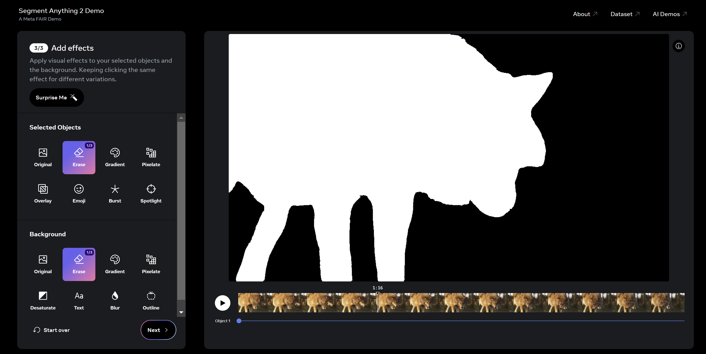
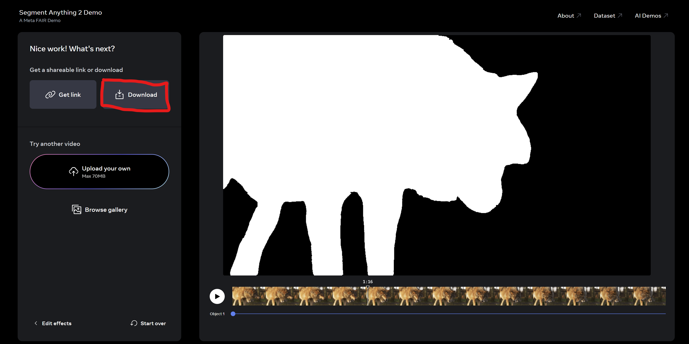

> The below instructions assume a Linux-based operating system with a bash shell and ffmpeg installed.  


## Step 1: Create Data Directory for Video
For your video of interest, `<video-name>.mp4`, you must first create a data directory to store the video information. We recommend naming the folder `./data/real-world/<video-name>`. 

We provide the script `00_initialize_directory.sh` to automate this! Simply pass in a video 
path and a name of an output directory:

```aiignore
bash 00_initialize_directory.sh <path_to_mp4> ./data/real-world/<video-name>
```

This will result in a directory formatted as follows:
```
video-name
├── rgb
│   └── 1x
│       ├── C_XXXXX.png
│       └── ...
└── sam2
└── video.mp4 
```

You can also set this directory up manually. Just make sure that `video.mp4` is at 24 frames per second, that each image `C_XXXXX.png` is a `png` file, and that `C` and `XXXXX` are completely numerical.

## Step 2: Get Instance Masks from Segment Anything V2
We use the latest [SAM2 Demo](https://sam2.metademolab.com/demo) to estimate temporally consistent instance masks.

* In your web browser, follow the [demo link](https://sam2.metademolab.com/demo), arriving at the following page:

* Click "change video" in the bottom left, and upload the video from `./data/real-world/<video-name>/video.mp4`. 
It is important to upload THIS video, because the SAM2 demo only operates on 24 FPS videos.
* Use SAM2 to segment out each foregound object that exhibits highly distinct motion:
  * Follow the demo's prompting to segment a SINGLE foreground object:
  
  * After reaching a suitable segmentation for this ONE foreground object, click "Good to Go" and then set the 
  foreground and backgrond effects to **Erase**, resulting in a binary mask.
  
  * Finally, click "Next" and then the "Download" Button. This downloads an `mp4` file. 
  * Move the `mp4` file into the `./data/real-world/<video-name>/sam2/` directory.
  * Repeat this for EACH foreground object that has distinct motion. 

> Note: due to the current code setup, there must be at least one foreground object present in each frame. If this does not
> happen in your video, please segment out a persistent part of the background as a "foreground" instance.

> Note: Segmenting more foreground instances is helpful but not necessary. We usually segment one to five obvious foreground
> instances, and then leave the rest for the dynamic background.

After this step, the folder `./data/real-world/<video-name>/sam2/` should be populated with `mp4` videos for each unique
foreground instance.

## Step 3: Preprocess Everything Else
We provide a script for this as well! 
Just pass the data directory and base conda environment to `preprocess_video.sh`:
```aiignore
bash preprocess_video.sh ./data/real-world/<video-name> ~/anaconda3
```
> Note: Running CoTracker typically takes over an hour, depending on the length of the video.

## Step 4: Verify You're Good to Go
Check that the data directory has all the following:
```aiignore
scene_datadir
├── camera
│   └── C_XXXXX.json
│   └── ...
├── camera_paths
│   ├── novelview_20KF.json
│   └── ...
├── rgb
│   └── 1x
│       ├── C_XXXXX.png
│       └── ...
├── depth
│   └── 1x
│       ├── C_XXXXX.npy
│       └── ...
├── segmentation
│   └── 1x
│       ├── C_XXXXX.npy
│       └── ...
├── tracks
│   └── 1x
│       ├── track_XXXXX.npy
│       └── ...
└── splits
│   ├── train.json
│   └── val.json
│── scene.json
└── dataset.json 
```
